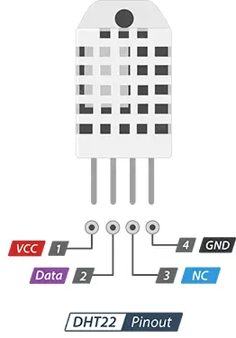
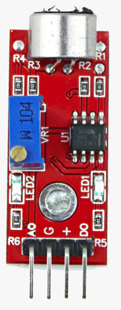
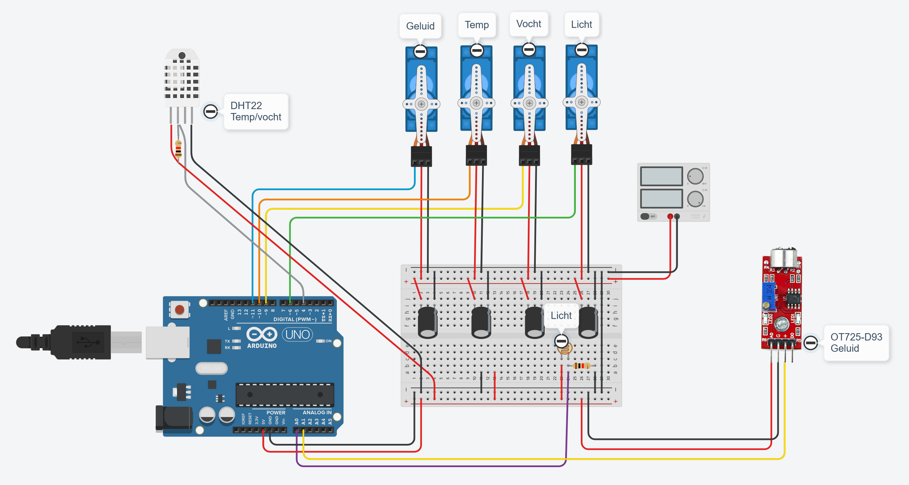

# slaapomgevingsmonitor

## Doel van het project
Doel van het project is om jonge kinderen bewust te maken van hun slaapomgeving en of aan de voorwaarden wordt voldaan voor een goede nachtrust. Daarvoor wordt een indicatie gegeven of de volgende zaken "in orde" zijn:

- Is het donker genoeg?
- Is de temperatuur niet te hoog?
- Is de luchtvochtigheid in orde?
- Is er niet te veel omgevingsgeluid?

Bovenstaande wordt voor deze jonge kinderen op een leuke manier zichtbaar gemaakt door middel van een vrachtwagen, waarop de status van bovenstaande kan worden bekeken. 

Op de vrachtwagen zijn vier figuren zichtbaar, die de verschillende zaken voorstellen. Deze figuren geven een "duimpje omhoog" of een "duimpje omlaag".

## Gebruikte componenten

Gebruikte componenten en links

- Arduino Uno (starter kit)
- Lichtsensor (photoresistor) - [How to Use a Photoresistor!](https://projecthub.arduino.cc/tropicalbean/how-to-use-a-photoresistor-1143fd)
- Luchtvochtigheidssensor (DHT22) - [Mit dem DHT11 Sensor Temperatur und Luftfeuchtigkeit messen](https://www.makerblog.at/2025/01/dht11-sensor-temperatur-und-luftfeuchtigkeit-messen-update/)
- Servo's (SM-S2309S) - [Servo Motor Basics with Arduino](https://docs.arduino.cc/learn/electronics/servo-motors/) [Specs](https://descargas.cetronic.es/microservo.pdf)
- Geluidssensor (OT725-D93) [How Does a Sound Sensor Work and how to Interface it with Arduino?](https://circuitdigest.com/microcontroller-projects/interfacing-sound-sensor-with-arduino)
- Temperatuursensor (TMP36) - [Using A TMP36 Temperature Sensor With Arduino](https://bc-robotics.com/tutorials/using-a-tmp36-temperature-sensor-with-arduino/) (wordt niet meer gebruikt)
- Diverse weerstanden en condensatoren om de sensoren en actuatoren correct aan te sluiten

[bron](https://lastminuteengineers.com/dht11-dht22-arduino-tutorial/)

[bron](https://roboelectrixx.com/product/sound-detection-sensor-module-for-intelligent-vehicle-arduino-compatible/)

## Schema

